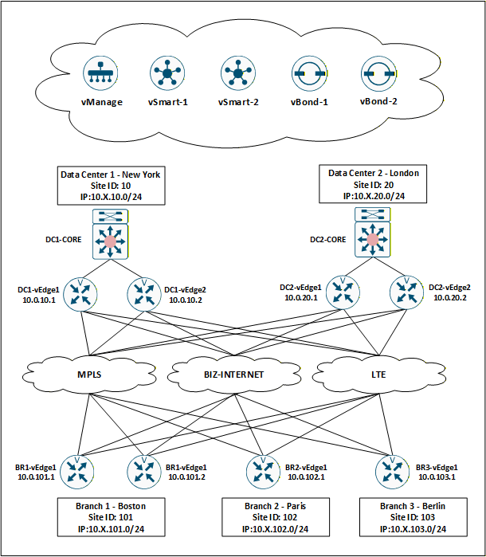
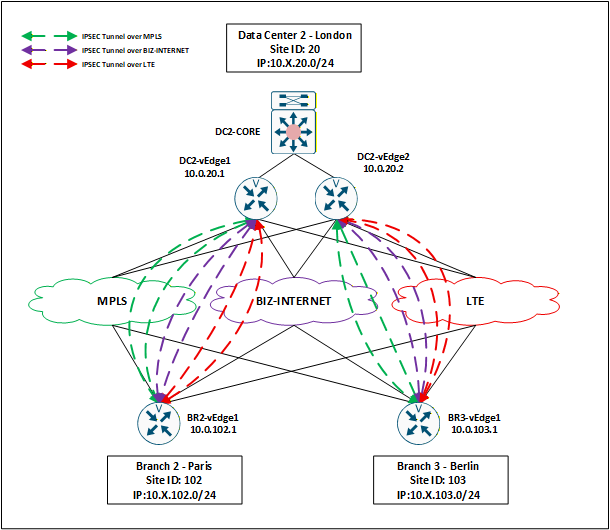

# EnterpriseNet-Cisco_SD-WAN_Global_Deployment_Project

## 1.Overview

This repository presents a research-oriented implementation of a Software-Defined WAN (SD-WAN) architecture designed to emulate a modern, resilient enterprise network spanning multiple geographic regions.

The topology consists of two distributed data centers located in New York (Site 10) and London (Site 20), interconnected with multiple branch sites across different regions (Boston, Paris, and Berlin). The control plane is centralized using redundant SD-WAN controllers (vManage, vSmart, and vBond), while the data plane is built on multiple underlay transport networks, including MPLS, business Internet, and LTE, enabling path diversity and high availability.

Each site is equipped with redundant edge devices (vEdge routers) to support multi-path connectivity, fast failover, and load distribution. The architecture supports cross–data center traffic engineering, regional optimization, and application-aware routing, reflecting real-world enterprise deployment scenarios.

This repository includes topology diagrams, device configurations, and validation commands used to build and test the environment.

---

## 2.Topology

The Visio network diagram shown above illustrates the overall architecture of this lab environment.

---

## 3.Research Scope
This project is not a production deployment, but a research and simulation study focusing on the following key design objectives:

Scalable topology design based on a dual data center model
Application-aware traffic engineering across multiple transport networks
Optimized path selection for cross–data center and inter-branch communication
Regional Internet breakout strategies
Resilient connectivity with multi-path redundancy
Security integration, including service chaining for traffic inspection
Tenant and VPN segmentation for traffic isolation
East–West traffic optimization within and across regions
Enterprise service sharing and resource centralization

---

## 4.Enterprise Network IP Scheme
This project adopts a hierarchical and structured IP addressing scheme to ensure scalability, readability, and alignment with site-based segmentation in the SD-WAN fabric.

### 4.1 Data Center Addressing

| Site | Location | Site ID | LAN Subnet | vEdge IPs |
|------|----------|---------|------------|-----------|
| DC1  | New York | 10      | 10.X.10.0/24 | 10.0.10.1, 10.0.10.2 |
| DC2  | London   | 20      | 10.X.20.0/24 | 10.0.20.1, 10.0.20.2 |

*Subnets are aligned with the **Service VPN Number**.

### 4.2 Branch Addressing

| Site | Location | Site ID | LAN Subnet | vEdge IPs |
|------|----------|---------|------------|-----------|
| BR1  | Boston   | 101     | 10.X.101.0/24 | 10.0.101.1, 10.0.101.2 |
| BR2  | Paris    | 102     | 10.X.102.0/24 | 10.0.102.1 |
| BR3  | Berlin   | 103     | 10.X.103.0/24 | 10.0.103.1 |

*Subnets are aligned with the **Service VPN Number**.

---

## 5.Per-Scenario Client Requirement Implementation
### 5.1 Star_Topology_Setup

---

## Device Configuration 
Please refer to project folder.
